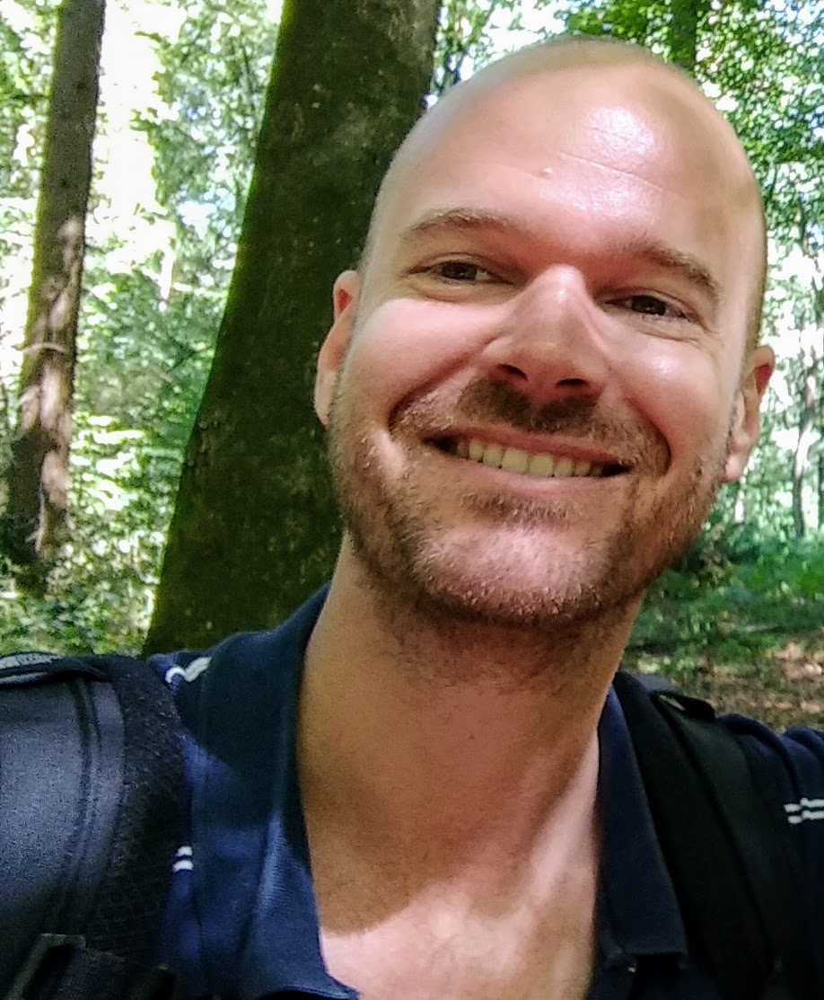

---
---

<link rel="stylesheet" href="settings.css">

# About me

I'm an almost graduated master student in Cognitive Neuroscience at Leiden University with a passion for all things AI. To scratch my itch for talking about things that interest me, I also teach statistics at the [Leiden University Psychology department](https://www.universiteitleiden.nl/en/social-behavioural-sciences/psychology).

I live with my wife and newborn daughter in The Hague, which is the city that houses the Dutch government but, interestingly, is not actually the capital. 

In my sparse spare time I enjoy programming, playing guitar and singing (in the shower and in bands), running and hiking.

My recent, shortened CV is available in English [here](docs/CV_RobCamstra_en.pdf) and in Dutch [here](docs/CV_RobCamstra_nl.pdf).